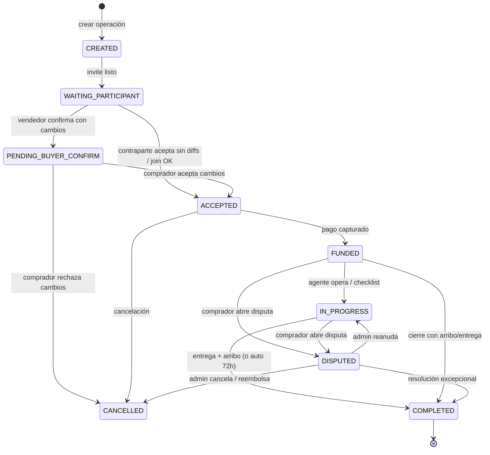
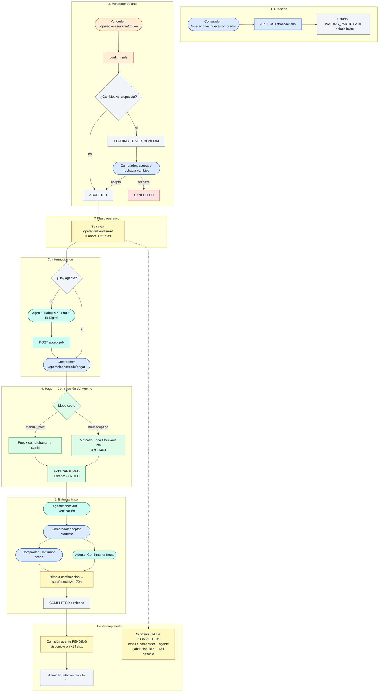
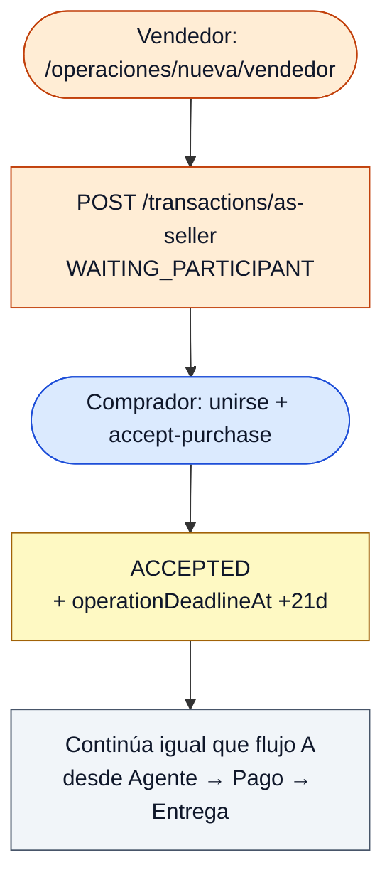
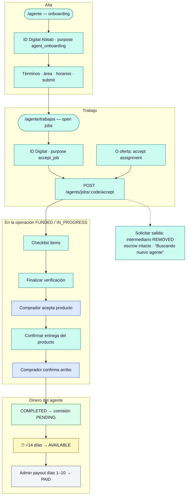
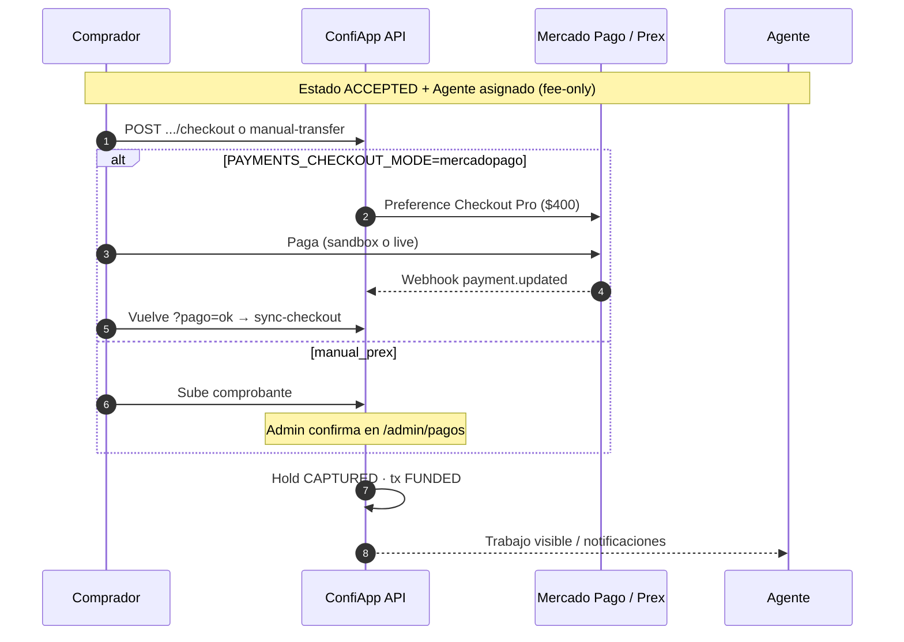
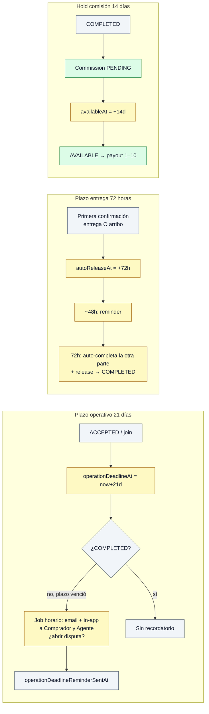
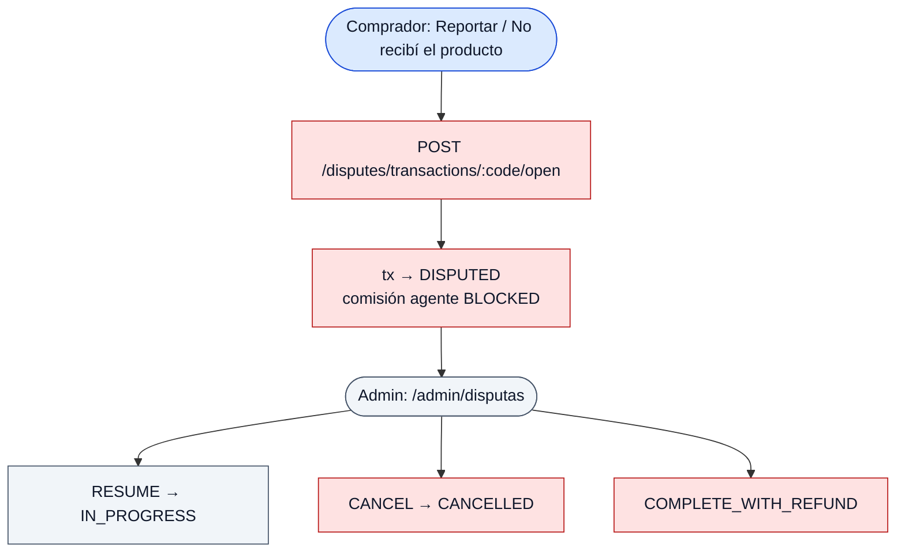
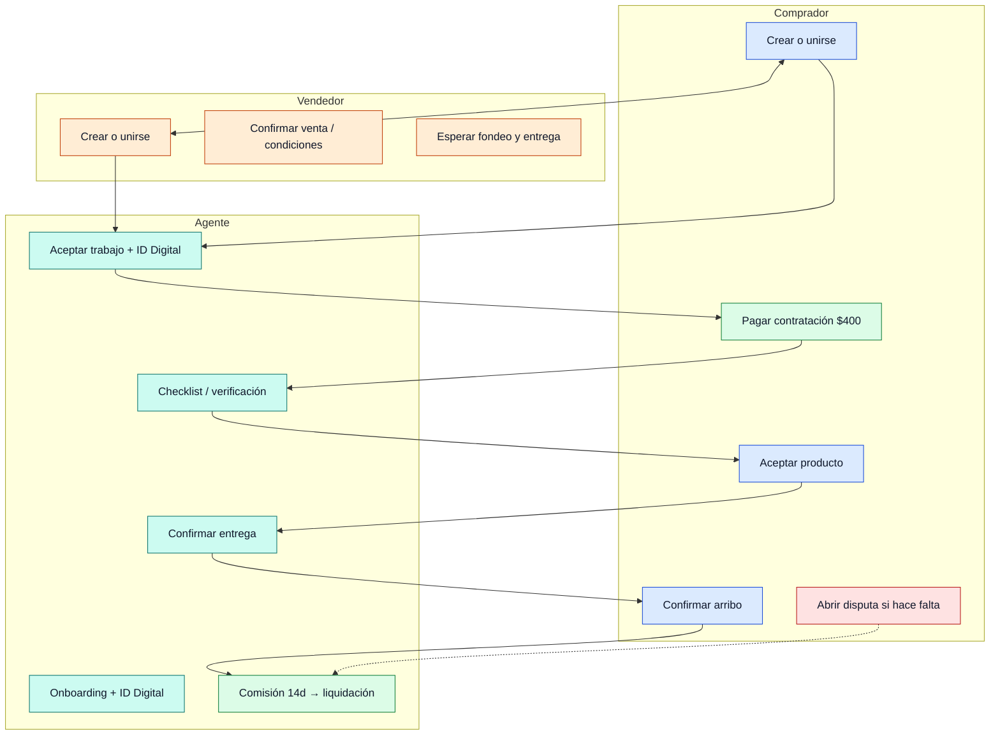

# Flujos de operación — Comprador, Vendedor y Agente

Documento de producto y desarrollo. Describe **cómo se vive una operación** según los tres roles, con énfasis en:

- creación e invitación
- aceptación / confirmación
- **pagos** (contratación del Agente vs resguardo completo)
- intermediación (agente)
- verificación, entrega y arribo
- **plazos** (21 días operativos, 72 h post-entrega, 14 días de comisión)
- disputas

**Última actualización:** 2026-09-27.

**Fuente de código:**  
`packages/database` (enums) · `apps/api/src/modules/transactions` · `payments` · `agents` · `disputes` · `finance` · `apps/web/src/features/transactions`.

---

## Leyenda de colores (diagramas)

| Color | Significado |
|-------|-------------|
| 🔵 Azul (`buyer`) | Acción o pantalla del **Comprador** |
| 🟠 Ámbar (`seller`) | Acción o pantalla del **Vendedor** |
| 🟢 Teal (`agent`) | Acción o pantalla del **Agente** |
| 💜 Púrpura (`pay`) | **Pago** / retención de fondos |
| 🟡 Amarillo (`deadline`) | Activación o vencimiento de **plazos** |
| 🔴 Rojo (`dispute`) | **Disputa** / reclamo |
| ⬜ Gris (`system`) | Job automático / sistema / admin |

En Mermaid, los nodos usan `classDef` con esos roles.

---

## 1. Roles y qué hace cada uno

| Rol | Quién es | Responsabilidades principales |
|-----|----------|-------------------------------|
| **Comprador** | Parte que adquiere el producto | Crear op (o unirse), pagar la **contratación del Agente** (modo default), aceptar/rechazar producto, confirmar **arribo**, abrir **disputa** si hace falta |
| **Vendedor** | Parte que ofrece el producto | Crear op (o unirse), confirmar venta / condiciones, esperar pago del comprador, coordinar retiro |
| **Agente** | Intermediario independiente | Onboarding + ID Digital, tomar trabajo, checklist, verificación, **confirmar entrega**, comisión 80 % tras COMPLETED |

En el modelo: `TransactionInitiator` = `BUYER` \| `SELLER`. El agente es `INTERMEDIARY` con `ACCEPTED`.

---

## 2. Modos de fondeo

| Modo | Código | Qué paga el comprador en la app |
|------|--------|----------------------------------|
| **Solo pago del Agente** (default) | `AGENT_FEE_ONLY` | Fijo **UYU $400** (`AGENT_FEE_ONLY_UYU_CENTS`) — “contratación del Agente”. El precio del producto se arregla fuera de ConfiApp. |
| **Resguardo completo** | `ESCROW_FULL` | Precio + comisión (solo si `FUNDING_ESCROW_FULL_ENABLED=true`) |

**Cobro técnico** (`PAYMENTS_CHECKOUT_MODE`):

| Valor | Comportamiento |
|-------|----------------|
| `mercadopago` | Checkout Pro (o MOCK sin token). Confirmación por webhook + sync al volver. |
| `manual_prex` | Transferencia Prex + comprobante → admin confirma → `FUNDED`. |

---

## 3. Máquina de estados (vista global)



**Labels UI** (no mostrar enums crudos): p. ej. `FUNDED` → “Pago protegido”, `WAITING_PARTICIPANT` → “esperando a la otra parte”.

---

## 4. Flujo A — Compra iniciada por el Comprador

### 4.1 Diagrama de secuencia (pasos + pagos + plazos)



### 4.2 Acciones por rol (compra iniciada por comprador)

| Paso | Comprador | Vendedor | Agente |
|------|-----------|----------|--------|
| Crear | Crea op + checklist + invite | — | — |
| Unirse | — | Abre enlace, confirma venta | — |
| Reconfirm | Si hay diffs: acepta/rechaza | Espera | — |
| Agente | Puede buscar / esperar open job | Idem | Acepta trabajo (ID Digital) |
| Pagar | Paga **$400** contratación | Espera “Pago protegido” | Aparece trabajo fondeado |
| Producto | Acepta / rechaza verificación | Coordina retiro | Checklist + finalize |
| Entrega | Confirma **arribo** | — | Confirma **entrega** |
| Disputa | Puede abrir disputa | Informado | Comisión puede bloquearse |
| Plazo 21d | Recibe recordatorio si sigue abierta | — | Recibe recordatorio |

---

## 5. Flujo B — Venta iniciada por el Vendedor



**Diferencia clave:** no suele haber `PENDING_BUYER_CONFIRM` (ese estado nace cuando el **vendedor** confirma una venta iniciada por comprador **con cambios**). Aquí el comprador acepta la propuesta del vendedor de una y queda `ACCEPTED`.

| Paso | Comprador | Vendedor | Agente |
|------|-----------|----------|--------|
| Crear | — | Crea op + invite | — |
| Unirse | Acepta compra | Comparte enlace | — |
| Resto | Igual que §4 | Igual que §4 | Igual que §4 |

---

## 6. Flujo C — Intermediación (Agente)



**ID Digital:** obligatorio al start de onboarding y en cada aceptación de trabajo (web). Credenciales: `ID_DIGITAL_*`. Detalle: [`ID_DIGITAL_AGENTS.md`](./ID_DIGITAL_AGENTS.md).

**Open jobs:** solo operaciones **fondeadas** visibles; el agente no “reserva” trabajo sin pago previo en el modo actual de producto.

---

## 7. Momentos de pago (detalle)



| Momento | Quién | Qué ocurre |
|---------|-------|------------|
| Checkout | Comprador | Preferencia MP o panel Prex |
| Confirmación | Sistema / admin | Webhook, sync return, o admin Prex |
| `FUNDED` | Sistema | Retención; open jobs ven la op |
| Release | Sistema | Al completar entrega/arribo (o auto 72h) |
| Comisión | Sistema | `AgentCommission` PENDING → AVAILABLE (+14d) |
| Liquidación | Admin | PayoutBatch días **1–10** del mes |

OAuth MP de agentes (vincular cuenta): independiente del cobro al comprador — ver [`FINANCE_MVP_NOTES.md`](./FINANCE_MVP_NOTES.md).

---

## 8. Plazos (activación y efecto)



| Plazo | Constante | Se activa cuando | Efecto |
|-------|-----------|------------------|--------|
| **21 días** operativos | `OPERATION_DEADLINE_DAYS` | Acuerdo (`ACCEPTED` / join) | **No cancela.** Recordatorio a comprador + agente (1 vez). Copy: “más de 20 días”. |
| **72 horas** post-entrega | `DELIVERY_AUTO_RELEASE_MS` | Primera de: entrega agente **o** arribo comprador | Auto-completa la otra confirmación y libera |
| **14 días** comisión | `AGENT_COMMISSION_HOLD_DAYS` | `COMPLETED` | Comisión pasa a AVAILABLE; liquidación admin 1–10 |

`assertNotPastDeadline` es **no-op**: la operación sigue usable tras los 21 días.

---

## 9. Disputa (reclamo)

Término en producto: **disputa** (ayuda/términos también dicen “reclamo”).



| Quién | Puede |
|-------|--------|
| Comprador | Abrir disputa en `FUNDED` / `IN_PROGRESS` |
| Vendedor / Agente | No abren disputa; reciben efectos / notificaciones |
| Admin | Resolver: reanudar, cancelar, reembolso |

---

## 10. Swimlane resumido (los tres roles)



---

## 11. Rutas web por rol

| Rol | Rutas |
|-----|-------|
| Comprador / Vendedor | `/operaciones`, `/operaciones/nueva/*`, `/operaciones/unirse/:token`, `/operaciones/:code`, `/operaciones/:code/pagar`, `/wallet`, `/mensajes`, `/notificaciones` |
| Agente | `/agente`, `/agente/trabajos`, `/agente/buscar` (+ mismas ops como intermediario) |
| Admin | `/admin/pagos`, `/admin/finanzas`, `/admin/disputas`, `/auditoria` |

---

## 12. Jobs / timers (sistema)

| Job | Frecuencia aprox. | Efecto |
|-----|-------------------|--------|
| `expireOperationalDeadlines` | 1 h | Recordatorio 21d (email + in-app); **no cancela** |
| `autoCompleteStaleDeliveries` | 15 min | Auto 72h entrega/arribo + release |
| `releaseDue` comisiones | 15 min | PENDING → AVAILABLE tras 14d |
| Expire ofertas agente | 15 s | Ofertas de asignación vencidas |

Endpoints: `POST /transactions/jobs/expire-deadlines`, `.../auto-delivery`, `POST /finance/jobs/release-commissions` (header `x-job-secret`).

---

## 13. Archivos ancla

```text
Estados / funding     packages/database/src/types/enums.ts
State machine         apps/api/src/modules/transactions/state-machine.ts
Plazo 21d             apps/api/src/modules/transactions/operation-deadline.ts
Plazo 72h             apps/api/src/modules/transactions/delivery-deadline.ts
Pagos                 apps/api/src/modules/payments/service.ts
Agentes               apps/api/src/modules/agents/*
Disputas              apps/api/src/modules/disputes/service.ts
Comisiones            apps/api/src/modules/finance/commission.service.ts
Constantes $400/14d   packages/shared/src/finance-constants.ts
UI detalle por rol    apps/web/src/features/transactions/ui/*OperationDetail.tsx
Legal / ayuda         apps/web/src/features/legal/content/{terms,help}.ts
```

---

## Ver también

- [`WEB_APP.md`](./WEB_APP.md) — pantallas y copy
- [`FINANCE_MVP_NOTES.md`](./FINANCE_MVP_NOTES.md) — cobro Prex/MP, OAuth agentes
- [`CONFIAPP_FINANCIAL_MVP.md`](./CONFIAPP_FINANCIAL_MVP.md) — spec financiera
- [`ID_DIGITAL_AGENTS.md`](./ID_DIGITAL_AGENTS.md) — Identidad Digital Abitab
- [`ARCHITECTURE.md`](./ARCHITECTURE.md) — monorepo
